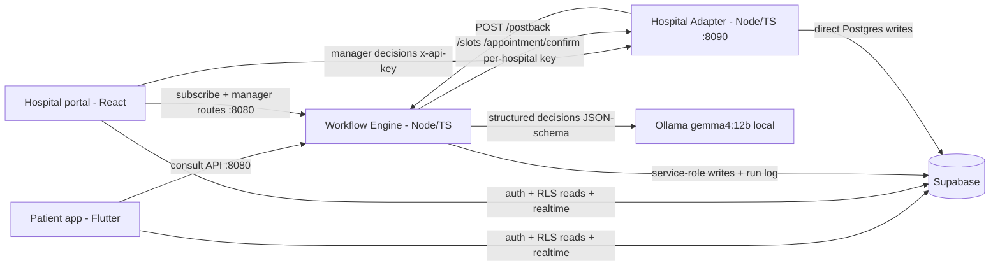
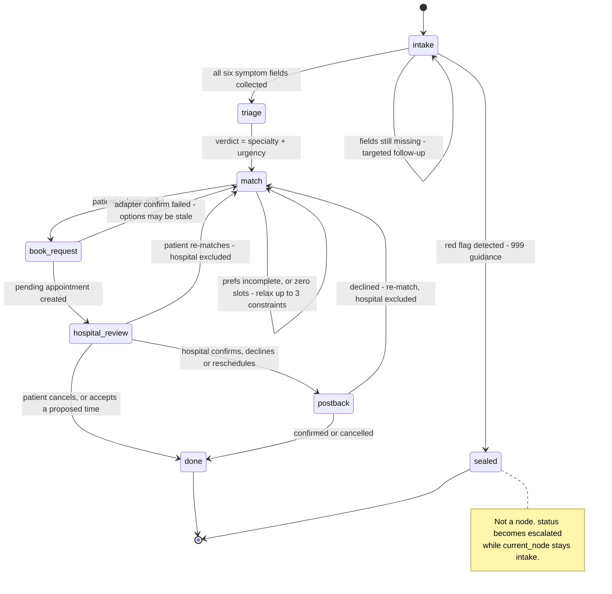

# AppointMed Workflow Engine (:8080)

The workflow engine is the AI orchestrator behind an AppointMed consultation: it
runs a local-LLM-driven state machine that collects symptoms, triages a
specialty + urgency, searches the hospital adapter for matching slots, submits
a booking, and tracks the hospital's response — all while logging every
decision, tool call, transition, and fallback to Postgres for a full audit
trail. It talks to the hospital adapter over HTTP (per-hospital API key) and
to a local Ollama server for every LLM call; it never talks to the mobile or
web apps directly — the engine is Phase 3 of the pitch, standing on its own
HTTP + Postgres/Supabase surface.

## Run

```
npm install
npm run dev          # tsx watch src/index.ts — auto-reload for local dev
npm start            # tsx src/index.ts — single run, used in the manual smoke
npm run typecheck    # tsc --noEmit
npm test             # vitest run --no-file-parallelism — hits the hosted Supabase DB
```

`npm test` runs sequentially (`--no-file-parallelism`) and against the real
hosted Supabase project (see `vitest.config.ts` for the widened hook/test
timeouts that absorb pooler latency) — there is no local/mocked DB mode.

## Config

Copy `.env.example` to `.env` and fill in the four `YOUR_...` placeholders with
your own Supabase project's values — the repository ships **no** credentials, so
the engine refuses to start until you do (it names the missing variable and the
file to fix). README.md §6 Part C shows where to find each value; Part D shows
what to paste. `npm run dev` from the repo root creates the `.env` for you if it
is missing, but cannot fill it in.

This `.env` is also the single source of truth for `npm test` (loaded by
`vitest.config.ts`) and for the repo-root `npm run db:*` scripts.

| Var | Default | Purpose |
|---|---|---|
| `PORT` | `8080` | HTTP port the engine listens on |
| `DATABASE_URL` | **placeholder — must be set** | direct SQL (`pg.Pool`) access to `workflow_runs`, `workflow_steps`, `appointments`, etc. Use the Session pooler string, not "Direct connection" |
| `SUPABASE_URL` | **placeholder — must be set** | Supabase Auth (verifies each request's bearer token) and Storage (medical file / verification-doc uploads) |
| `SUPABASE_ANON_KEY` | **placeholder — needed by `npm test`** | public key; the test suite uses it to sign its fixture patient in. The server itself never needs it |
| `SUPABASE_SERVICE_ROLE_KEY` | **placeholder — must be set** | server-side Supabase client — bypasses RLS; never expose this to a client app |
| `ADAPTER_URL` | `http://localhost:8090` | base URL of the hospital adapter (`appointmed_hospital_adapter`) |
| `POSTBACK_SECRET` | `appointmed-postback-demo-secret` | validates the inbound `x-postback-secret` header on `POST /postback`. Localhost-only shared secret; must match the adapter's. Change both for a real deployment |
| `OLLAMA_URL` | `http://localhost:11434` | base URL of the local Ollama server |
| `MODEL_DEFAULT` | `gemma4:12b` | model used for every stage unless overridden per-stage |
| `MODEL_FALLBACK` | `qwen3.5:9b` | second model tried if the stage model's own attempts fail |
| `MODEL_INTAKE` / `MODEL_TRIAGE` / `MODEL_PREFS` / `MODEL_RELAX` / `MODEL_SUMMARY` / `MODEL_ATTACHMENT` | unset → falls back to `MODEL_DEFAULT` | per-stage model overrides, one per workflow stage (see below). `MODEL_ATTACHMENT` must be vision-capable — that stage receives uploaded images directly |

## Consult API

Every route below except `POST /postback` and `POST /portal/subscribe`
requires `Authorization: Bearer <Supabase access token>`. Errors are always
`{ "error": "<snake_case_code>" }` — including unhandled faults, which the
global Fastify error handler turns into `{ "error": "internal_error" }` (500)
rather than leaking driver/stack text.

Every `/consult/*` and `/runs/*` route returns the same envelope:

```ts
interface ConsultReply {
  runId: string;
  node: 'intake' | 'triage' | 'match' | 'book_request' | 'hospital_review' | 'postback' | 'done';
  status: 'active' | 'waiting_hospital' | 'completed' | 'failed' | 'escalated';
  reply: string;                     // assistant-facing chat text for this turn
  verdict?: { specialty: string; urgency: 'asap' | 'week' | 'month' | 'routine'; explanation: string; redFlags: string[] };
  slotOptions?: SlotOption[];        // present once matching has slots to offer
  appointment?: { id: string; status: string; startsAt: string; hospitalName: string;
                  specialistName: string; specialty: string; price: number | null };
  escalated?: boolean;               // true once a red-flag symptom has sealed the run
}
```

| Route | Auth | Purpose |
|---|---|---|
| `POST /consult/start` | bearer | start a new run (fresh `workflow_runs` row + `ai_chats` row); returns the opening greeting |
| `POST /consult/:runId/message` `{text}` | bearer | advance the state machine one turn (intake → triage → match, including preference collection and slot search) |
| `POST /consult/:runId/upload` | bearer, multipart | attach an image or PDF — **intake only** (409 outside intake); images are queued as base64 for the next model turn, PDFs are text-extracted inline |
| `POST /consult/:runId/select-slot` `{slotId}` | bearer | confirm a presented slot → submits the booking via the hospital adapter, transitions to `hospital_review` |
| `GET /consult/:runId` | bearer | current run state + full chat transcript (owner-only; 404 for any other user's run) |
| `GET /runs/:runId/steps` | bearer | the full `workflow_steps` audit trail for a run — see **Run-log** below |
| `POST /appointments/:id/respond` `{action}` | bearer | patient responds to a hospital decision: `accept_reschedule` \| `re_match` \| `cancel` |
| `POST /postback` | `x-postback-secret` header | hospital adapter → engine: appointment lifecycle push — see **Postback contract** below |
| `POST /portal/subscribe` | none | hospital signup: creates the hospital, subscription, first API key, starter specialist/slot inventory, and the manager's account |
| `POST /portal/specialists/:id/toggle` | bearer (`hospital_manager`) | flip a specialist's `is_active` (own hospital only; 404 on a foreign specialist) |
| `POST /portal/api-key/regenerate` | bearer (`hospital_manager`) | rotate the caller's hospital API key |
| `POST /portal/verification-docs` | bearer (`hospital_manager`), multipart | upload one or more hospital verification documents |
| `GET /portal/appointments/:id/attachments` | bearer (`hospital_manager`) | mint 60-minute signed URLs for the files the patient uploaded during the consultation behind this appointment (own hospital only; 404 on foreign/declined/cancelled/unknown) |
| `GET /health` | none | liveness check |

### `GET /portal/appointments/:id/attachments`

Bearer auth, hospital managers only. Returns 60-minute signed URLs for the files
the patient uploaded during the consultation behind this appointment.

- `403 manager_only` — the caller is not a `hospital_manager`.
- `404 appointment_not_found` — the appointment belongs to another hospital, has
  been declined or cancelled, or does not exist. These are deliberately
  indistinguishable.
- `200 { "attachments": [{ "type", "name", "observation", "signedUrl" }] }` —
  `signedUrl` is `null` for any single file whose signature failed. Storage paths
  are never returned as a separate field.

Every call that returns at least one attachment writes a `tool_call` step against
the patient's run recording the hospital and the manager who looked.

## Postback contract

`POST /postback` mirrors the Phase-2 hospital adapter's outbound contract
exactly — see `appointmed_hospital_adapter/README.md` for the sender side
(bounded retry, delivery tracking). Body:

```json
{
  "externalAppointmentId": "...",
  "hospitalId": "...",
  "action": "confirmed | declined | rescheduled | cancelled",
  "proposedStartsAt": "ISO 8601 — required when action is \"rescheduled\""
}
```

Auth is the shared `x-postback-secret` header (must equal `POSTBACK_SECRET`) —
there is no Supabase bearer token on this route, since the adapter has no
patient session. A `rescheduled` postback moves the run to a patient-facing
decision point (`respond` with `accept_reschedule` or `re_match`); `confirmed`
and `cancelled` close the run; `declined` re-enters matching, excluding that
hospital.

## Model configuration

Six workflow stages each make their own structured (JSON-schema-constrained)
Ollama call: **intake**, **triage**, **prefs**, **relax**, **summary**,
**attachment**. Each stage resolves its model independently — `MODEL_INTAKE`
etc. if set, else `MODEL_DEFAULT` — and every call retries its stage model
twice, then `MODEL_FALLBACK` twice, before raising `OllamaUnavailableError`
(`src/ollama/client.ts`). **One exception:** a call that carries images (the
`attachment` stage's photo pass) never retries against `MODEL_FALLBACK` — that
model is not documented as vision-capable, and a non-vision model asked to
describe a photo would return a confident, fabricated `{observation}` rather
than failing loudly, so such a call gets two attempts against its own stage
model only before raising `OllamaUnavailableError`. When even that is
exhausted, the calling node degrades to a deterministic, logged fallback
instead of crashing the run — e.g. triage without a working model falls back
to `General Practice` / `routine`, an unreachable attachment stage stores the
file with a `NOT_ANALYSED` observation, matching's constraint-relaxation falls
back to a fixed relax order (time → hospital → budget). This is the "LLM
removed ⇒ workflow collapses safely" behavior: stop Ollama mid-run and the
consult keeps responding, just without model-quality reasoning.

## Run-log / audit trail

`GET /runs/:runId/steps` returns every `workflow_steps` row for a run, in
order, each tagged with a `kind`:

- `llm_decision` — a structured Ollama call succeeded (records the model used and latency)
- `tool_call` — a call to the hospital adapter (`getSlots`/`confirm`/`cancel`) or a file tool (`extractPdfText`/`storeMedicalFile`)
- `transition` — the run moved to a new node
- `fallback` — an Ollama call failed and a deterministic fallback decision was substituted
- `error` — an underlying call failed and was handled without crashing the run (e.g. the hospital adapter was unreachable during matching)

For a demo: drive a consult through `/consult/start` → a few `/message` turns
→ `/select-slot`, then hit `GET /runs/:runId/steps` — it's the inspectable
proof that the "AI" is a sequence of real, logged decisions and tool calls
rather than a black box, including any `fallback`/`error` entries if Ollama or
the adapter degrades mid-run.

---

# Architecture

> Reproduced here are the sections that concern the engine: the system
> context (§1), the workflow engine itself (§2), the LLM reasoning contract (§3), the engine-side
> edge cases (§6) and the audit trail (§7). Paths are relative to this directory unless prefixed
> with `../`.

## System overview

AppointMed turns a fragmented, manual healthcare errand — *describe symptoms, work out which
specialist you need, find a slot you can afford at a hospital you can reach, get the hospital to
agree* — into a single automated workflow. Five components carry it. A **Flutter patient app**
(`../appointmed_mobile/`) is the patient's surface: it talks to the workflow engine for the
consultation and to Supabase directly for auth, row-level-security-scoped reads and realtime
appointment updates. A **Node/TypeScript workflow engine** (this directory, port 8080) is the
orchestrator and the only component that reasons: it runs a persisted seven-node state machine, and
at every node that requires a judgement it calls a **local LLM served by Ollama** (port 11434,
`gemma4:12b` by default) for a JSON-Schema-constrained decision, then dispatches deterministically on
the result. A **simulated hospital adapter** (`../appointmed_hospital_adapter/`, port 8090) stands in
for a real hospital information system, exposing a per-hospital API-key REST surface for slot search,
booking and manager decisions, and calling back into the engine when a hospital decides. A **React
hospital portal** (`../appointmed_website/`, port 5173) puts a human in the loop: managers review the
AI's clinical case report and priority, then confirm, decline or reschedule — over the exact same
public adapter API a real hospital integration would use. **Hosted Supabase** (Postgres + Auth + Storage +
Realtime) is the shared substrate; clients read it under least-privilege RLS and can write almost
nothing (two narrow column grants), while the two Node services hold the privileged credentials.



The patient app and the portal never call each other, and neither one contains workflow logic. Every
decision, every external call and every state transition happens inside the engine and is written to
an append-only step log (see **Auditability** below).

## The workflow engine (rubric core)

A consultation is a **run**: a row in `workflow_runs` holding a `current_node`, a `status` and a JSON
`state` blob. The engine keeps nothing in memory between requests — every turn loads the run from
Postgres, advances it, and saves it back. That is what makes runs resumable and what makes the step
log complete.

`Node` (`src/workflow/types.ts:1`) has exactly seven values:
`intake | triage | match | book_request | hospital_review | postback | done`.
`RunStatus` has five: `active | waiting_hospital | completed | failed | escalated`.

Two precise points that the diagram alone would hide:

- **Re-match is a transition, not a node.** A declined booking, or a patient choosing to re-match,
  sends `current_node` back to `match` with the offending hospital appended to
  `state.excludeHospitalIds`.
- **`escalated` is a status, not a node.** When intake detects a red flag the run's status becomes
  `escalated` while `current_node` stays `intake`; `advanceWithMessage` then short-circuits every
  later message to fixed emergency guidance without calling the model at all
  (`src/workflow/machine.ts:9-12`).



| Node | 🧠 LLM decision schema | Tools called | Edge handling | Fallback if the model is unreachable |
|---|---|---|---|---|
| `intake` | `intakeSchema` → `{reply, complete, redFlag, redFlagReason?, fields{mainComplaint, duration, severity, associatedSymptoms, medicalHistory, currentMedications}}` | `storeMedicalFile` (Supabase Storage, `medical-files`), `extractPdfText` (pdf-parse, first 4 000 chars); transcript read/append | `complete:false` loops with a targeted follow-up; vague or contradictory input is told to clarify rather than guess; `redFlag:true` seals the run; uploads outside intake → `409 uploads_only_during_intake`, on a sealed run → `409 consultation_escalated` | Apologetic hold reply, run stays `active` at `intake`, `fallback` step logged. **No fields are extracted**, so the run can never progress. |
| `triage` | `triageSchema` → `{specialty (enum of 9), urgency (asap\|week\|month\|routine), explanation, redFlags[]}`, then `summarySchema` → an eleven-field case report (`summary, chiefComplaint, historyOfPresentIllness, associatedSymptoms, pastMedicalHistory, currentMedications, attachmentFindings, triageAssessment, redFlags, clinicianNotes, priority`) | none | Runs in the same turn intake completes, so the patient sees one continuous reply: verdict + disclaimer + first booking question. The case report is generated in this same turn — by triage, all six symptom fields are known and every attachment already exists (uploads are intake-only) — and stored on `run.state.report` for `book_request` to persist verbatim | Triage: hard-coded `General Practice` / `routine` verdict, `fallback` step logged. Case report: `fallbackReport()` assembles a deterministic report from the stored symptom fields and attachment descriptions (priority from the same static urgency map), `fallback` step logged under `{for: "case_report"}`. Safe, but no specialty, urgency or clinical-summary intelligence remains. |
| `match` | `prefsSchema` → `{reply, complete, prefs{budget, preferredHospital, preferredTime}}`, then `relaxSchema` → `{relax: time\|hospital\|budget, explanation}` when a search comes back empty | `adapter.getSlots` once per candidate hospital; Postgres picks the candidates — every hospital with an active API key, minus `excludeHospitalIds`, narrowed by a name match when the patient named a preferred hospital | Incomplete prefs keep asking; zero results trigger up to 3 LLM-chosen relaxations (max 4 search rounds) before a friendly give-up that leaves the run alive; an adapter error yields a retry-later reply and parks the run at `matchPhase:'ready'`; the relaxation budget resets on every new matching cycle | Prefs: apologetic hold reply — preferences are never extracted, so no search ever runs. Relax: fixed order `time → hospital → budget`. |
| `book_request` | none — this node makes no LLM call. Booking is a pure database write that reads the case report already generated at `triage` (`run.state.report`) | `adapter.confirm` (per-hospital key) | Guarded against double-tap: a run already past `match` returns `409 already_booked`; an unknown or un-presented slot returns `400 unknown_slot_option`; a failed confirm (e.g. the slot was just taken) returns the run to `match` with `matchPhase:'ready'` so fresh options can be fetched | n/a — no model is called here. A run persisted before this report shipped (so `state.report` is empty) falls back to `fallbackReport()` and logs a `fallback` step under `{for: "case_report", reason: "run_predates_triage_report"}`. |
| `hospital_review` | none | none — the run is parked | Any further patient message returns "your booking request is with the hospital team"; the run holds `status:'waiting_hospital'` | n/a — this node needs no model. |
| `postback` | none | `adapter.cancel` (best-effort, on patient cancel or on re-matching a proposed time) | The `appointments` UPDATE is scoped by `external_appointment_id` **and** `hospital_id` **and** a non-terminal status, so a wrong-hospital, unknown or replayed postback is a `404` that changes nothing; a patient's local cancel still succeeds if the hospital is unreachable | n/a — deterministic. |
| `done` | none | none | Terminal; further messages get a "start a new consultation" reply | n/a |

**`book_request` is a transient label.** `bookSelectedSlot` requires the run to still be at `match`,
logs its steps under the node name `book_request`, then writes `hospital_review` (on success) or
`match` (on failure). `workflow_runs.current_node` therefore never actually rests at `book_request`,
even though the column's check constraint permits it — the value exists to group the booking step's
audit rows.

## LLM reasoning contract

See **Model configuration** above for the env-var surface; this section is the contract itself.

**Structured intent, deterministic dispatch.** The model never executes anything. Each reasoning
node builds a message list, hands `OllamaHttpClient.structured()` a JSON Schema, and gets back a
typed record; the engine's own TypeScript then decides what happens. Concretely, the client POSTs to
`{OLLAMA_URL}/api/chat` with `{model, messages, stream: false, format: <schema>, options: {temperature: 0.2}}`
and `JSON.parse`s `message.content`. Ollama's `format` field constrains decoding to the schema, so
`specialty` can only ever be one of the nine allowed strings and `urgency` one of four — the engine
does not have to defend against a hallucinated specialty, and `additionalProperties: false` keeps
stray keys out.

**Per-stage models.** `Stage` is `intake | triage | prefs | relax | summary | attachment`. All six
default to `MODEL_DEFAULT` (`gemma4:12b`) and each is independently overridable —
`MODEL_INTAKE`, `MODEL_TRIAGE`, `MODEL_PREFS`, `MODEL_RELAX`, `MODEL_SUMMARY`, `MODEL_ATTACHMENT` —
so a heavier model can be pointed at triage alone without slowing intake. `MODEL_ATTACHMENT` carries
an extra requirement: it must be vision-capable, since the attachment stage receives uploaded images
directly. `MODEL_FALLBACK` (`qwen3.5:9b`) is the second-choice model in the retry ladder for every
stage except a call that carries images — see the exception below.

**Bounded retry ladder.** For each of `[stage model, fallback model]`, two attempts, i.e. at most
four HTTP calls, each under a 90-second `AbortSignal.timeout`. A non-200, a network failure *and* an
unparseable body all count as failures. Only when all four fail does the client raise
`OllamaUnavailableError` — the single exception type every node catches to enter its documented
fallback. Anything else propagates and becomes a clean `500 {error:"internal_error"}`.

**Exception: calls that carry images never reach the fallback model.**
`OllamaHttpClient.structured()` inspects the outgoing messages for `images`, not the stage name, so
this applies to any vision call. `MODEL_FALLBACK` is not documented as vision-capable, and constrained
decoding only guarantees the *shape* of a reply, never its truth — a non-vision model asked to
describe a photo would return a confident, fabricated `{observation}` instead of failing. Such a call
gets two attempts against its own stage model only, then raises `OllamaUnavailableError` directly
(`src/ollama/client.ts`) — which `describe()` (`src/tools/attachments.ts`) already catches and
degrades to a logged `NOT_ANALYSED` observation, exactly the outcome an unanalysed file should show.

**Why not native function-calling.** The models involved do advertise a `tools` capability, so this
is a deliberate choice rather than a limitation. Three reasons, all visible in the code: (1) every
decision here is a *record the engine persists and later replays* — the intake fields, the verdict,
the preferences — not a one-shot side effect, and constrained decoding gives that record a schema the
database column checks already agree with; (2) keeping dispatch in TypeScript means the whole
workflow is testable against a stub that simply returns plain objects (`test/stub-ollama.ts`), which
is how this suite runs deterministically with no model present; (3) any Ollama model supporting
`format` is a drop-in, with no tool-calling fine-tune required.

**What breaks when the local LLM is removed.** Each node degrades to something *safe* — never a
crash, never a wrong booking — but the coordination itself disappears:

| Stage | With the local LLM | Without it |
|---|---|---|
| intake | Extracts six symptom fields from free text, asks targeted follow-ups, flags emergencies | Nothing is extracted; the run repeats a hold message forever and **never leaves `intake`** |
| attachment | Describes each uploaded photo or document in plain language at upload time, feeding both intake (documents) and triage (documents + photos) | The file is still stored; its description reads `NOT_ANALYSED` ("Not analysed — AI was unavailable..."). A vision call never retries against the non-vision fallback model, so an unseen photo is never fabricated — it is always marked unanalysed instead |
| triage | Chooses one of nine specialties and an urgency that sets the search window (2 days for `asap`, 7 otherwise) | Everyone is sent to General Practice, routine — no triage remains |
| triage (case report) | Writes the eleven-field clinical case report — chief complaint, history of present illness, attachment findings, triage assessment, clinician notes, priority, etc. — that the hospital manager reviews | `fallbackReport()`: a deterministic report assembled from the stored symptom fields and attachment descriptions; priority from the same static urgency map |
| match (prefs) | Reads budget, hospital and time-of-day out of conversational text | Preferences are never captured, so no slot search is ever issued |
| match (relax) | Picks which constraint to loosen given the situation, and explains it | Fixed `time → hospital → budget` order with a generic sentence |

This is directly demonstrable, and was verified for the architecture doc: with `OLLAMA_URL` pointed at
a dead port, a two-message consultation produced only `fallback` steps, captured **0 of 6** symptom
fields, and left the run sitting at `intake`/`active`. No triage, no matching, no booking — the
system reduces to a stateless apology loop.

## Edge cases & failure handling

Every row cites the test that proves it.

| Situation | Behaviour | Proven by |
|---|---|---|
| Ambiguous or contradictory symptom description | The intake prompt requires a clarifying question rather than a guess; `complete:false` keeps the loop open and merges whatever *was* learned | `test/intake.test.ts` — *"incomplete intake asks a follow-up and merges fields"* (asserts the follow-up text and that `state.symptoms.mainComplaint` persisted) |
| Missing booking preferences | Match keeps asking until budget, hospital and time are all known; no search is issued early | `test/match.test.ts` — *"incomplete prefs keep asking"* |
| Emergency red flag | Run status flips to `escalated`, the reply carries 999 guidance, and the run is **sealed**: later messages and uploads are answered deterministically with no model call at all | `test/intake.test.ts` — *"red flag escalates deterministically"* and *"an escalated run seals further messages to a fixed emergency reply (no LLM call)"*; `test/upload.test.ts` — *"an escalated run seals the upload route: 409, nothing stored, no LLM call"* |
| No slots match the constraints | The model picks one constraint to relax and explains it; up to 3 relaxations / 4 search rounds, then a friendly give-up that leaves the run alive and re-runnable. The budget resets per matching cycle | `test/match.test.ts` — *"empty result triggers LLM-chosen relaxation (time) and a wider re-query with explanation"*, *"exhausted relaxations end with a friendly no-slots reply, run stays in match"*, *"relaxation budget resets on re-entry: a second matching cycle on the same run gets its own 3 attempts"* |
| Preferences are honoured, not discarded | Budget, hospital and time-of-day all filter the presented options | `test/match.test.ts` — *"prefs are used: budget + hospital + morning filter the options"* |
| Hospital declines the booking | Run returns to `match`, the declining hospital is added to `excludeHospitalIds`, and the next search draws only from the remainder | `test/postback.test.ts` — *"declined postback re-enters match with the hospital excluded"*; `test/respond.test.ts` — *"re\_match after a declined postback returns fresh slotOptions from the remaining hospital only"* |
| Hospital proposes a different time | The patient can accept (appointment confirmed, run completes) or re-match (the proposal is cancelled at the hospital first, then re-matching resumes) | `test/respond.test.ts` — *"accept\_reschedule after a rescheduled postback confirms the proposed time and completes the run"*, *"re\_match after a reschedule\_proposed appointment cancels it via the adapter first"* |
| Local LLM unreachable | Bounded retry (2 models × 2 attempts) then `OllamaUnavailableError`; each node logs a `fallback` step and returns its safe degradation. The run is never lost | `test/ollama-client.test.ts` — *"retries same model on invalid JSON, then falls back to the fallback model"* and *"throws OllamaUnavailableError after all attempts fail"*; `test/intake.test.ts` — *"ollama outage during intake degrades gracefully, run stays alive"*; `test/triage.test.ts` — *"triage model failure falls back to General Practice / routine and logs a fallback step"* |
| Adapter unreachable during slot search | An `error` step is logged and the patient gets a retry-later reply; the run parks at `matchPhase:'ready'` so the next message re-searches | `test/match.test.ts` — *"adapter outage during search is a logged error with a retry-later reply, not a dead end"* |
| Booking fails at the hospital (slot just taken) | The run drops back to `match` with a "send any message and I'll find fresh options" reply; the hospital side returns `409 slot_taken` under a row lock | `test/booking.test.ts` — *"adapter failure on confirm keeps the run alive with a retry reply"*; `../appointmed_hospital_adapter/test/booking.test.ts` — *"double-booking the same slot returns 409 slot\_taken"* |
| Duplicate / replayed client actions | A second `select-slot` on a booked run is `409 already_booked` with no second adapter call; re-matching a stale declined appointment while the run already holds a live one is `409 run_has_live_appointment` | `test/booking.test.ts` — *"a second select-slot on a booked run is rejected (no duplicate confirm or appointment)"*; `test/respond.test.ts` — *"re\_match on a stale declined appointment is rejected once the run already has a live appointment (double-booking guard)"* |
| Hospital unreachable when a patient cancels | `adapter.cancel` is best-effort: the failure is logged as an `error` step and the patient's cancellation still succeeds locally | `test/respond.test.ts` — *"cancel is best-effort: an adapter outage does not block the patient cancel"* |
| Malformed or hostile input | Rejected before it can reach a SQL cast or act as a wildcard | `test/postback.test.ts` — *"empty externalAppointmentId is rejected, not treated as a wildcard match"*, *"invalid action value → 400 invalid\_postback, appointment unchanged"* |
| Cross-tenant access attempt | Always a `404`, never another party's row | `test/respond.test.ts` — *"responding to a foreign patient's appointment returns 404, never someone else's row"*; `test/intake.test.ts` — *"foreign run id → 404"*; `test/postback.test.ts` — *"postback with the wrong hospitalId 404s and leaves the appointment unchanged"* |
| Unexpected internal error | A single clean `500 {error:"internal_error"}` — never a stack trace or driver text | `test/error-handler.test.ts` — *"an uncaught route error yields a clean 500 { error: internal\_error }, never Fastify's default leaking shape"* |

**One honest gap.** There is *no* retry around the database. Postgres is treated as
must-be-available: an outage surfaces through the error handler as a clean `500`, and because run
state is only persisted after a successful turn, nothing is corrupted — but the turn is simply lost
and the patient retries. Retry/circuit-breaking exists for the model (4 attempts) and for postback
delivery (3 attempts), not for the datastore.

## Auditability

Two tables carry the audit trail. The `kind` values are listed under **Run-log / audit trail** above.

`workflow_runs` — `id`, `user_id`, `status` (5-value check), `current_node` (7-value check),
`state jsonb`, `created_at`, `updated_at` (trigger-maintained), indexed on `(user_id, created_at desc)`.
`state` holds the live symptom fields, attachments, preferences, verdict, presented options,
`excludeHospitalIds` and `relaxations`.

`workflow_steps` — `id`, `run_id` (FK, `on delete cascade`), `seq`, `node`, `kind ∈ {llm_decision,
tool_call, transition, error, fallback}`, `input jsonb`, `output jsonb`, `model`, `latency_ms`,
`created_at`, with `unique (run_id, seq)` and an index on `(run_id, seq)`. `logStep` allocates `seq`
as `coalesce(max(seq),0)+1` inside a single `insert … select`; the unique constraint is the backstop
if two writes for one run ever raced. Model name and latency are recorded for `llm_decision` steps
and left null elsewhere, which makes the LLM's share of a run measurable.

**A real run.** The log below is from run `5dc0bb5d-44a0-4ab6-9739-9a3aeb1eff49`, driven end-to-end on
2026-07-26 against the live database with the real local model (`gemma4:e4b` on Ollama) and the real
adapter on :8090, and completed by a genuine manager `confirm` sent to
`POST /appointment/decision`. All 32 steps are listed; the *Detail* column paraphrases the stored
`input`/`output` JSON for width, and three rows are reproduced verbatim underneath.

> **This capture predates the case-report move.** It was taken on 2026-07-26, before the change that
> moved the case-report call from `book_request` to `triage` and expanded it from a two-field
> `{summary, priority}` into the eleven-field report described under **Model configuration** above.
> `seq 30` below still shows the pre-change shape — the note directly under the table explains what
> the real step looks like today.

| seq | node | kind | model | ms | Detail |
|---|---|---|---|---|---|
| 1 | intake | llm_decision | gemma4:e4b | 46 206 | Extracted `mainComplaint` only; `complete:false`; asked how long it had been going on |
| 2 | intake | llm_decision | gemma4:e4b | 6 495 | Added `duration:"About two weeks"`, `severity:6`; asked about associated symptoms |
| 3 | intake | llm_decision | gemma4:e4b | 8 993 | Added history, associated symptoms, medications; `complete:true` |
| 4 | intake | transition | — | — | `to: triage`, carrying all six fields |
| 5 | triage | llm_decision | gemma4:e4b | 12 262 | `specialty:"Cardiology"`, `urgency:"asap"`, 1 red flag |
| 6 | triage | transition | — | — | `to: match` |
| 7 | match | llm_decision | gemma4:e4b | 5 785 | `prefs {budget:250, preferredTime:"morning", preferredHospital:null}`; `complete:true` |
| 8 | match | transition | — | — | `prefsComplete:true` |
| 9–17 | match | tool_call ×9 | — | — | `adapter.getSlots` fanned out over all 9 subscribed hospitals; counts `0, 12, 12, 12, 12, 0, 20, 12, 0` |
| 18 | match | llm_decision | gemma4:e4b | 5 733 | Patient messaged again while options were shown → prefs re-confirmed |
| 19 | match | transition | — | — | `prefsComplete:true` (second matching cycle) |
| 20–28 | match | tool_call ×9 | — | — | Second `adapter.getSlots` fan-out, same 9 hospitals |
| 29 | book_request | tool_call | — | — | `adapter.confirm` → `externalAppointmentId: ext_de4780d577891965` |
| 30 | book_request | llm_decision | gemma4:e4b | 11 535 | Case summary for the manager, `priority:"high"` — **pre-branch capture, see note below** |
| 31 | book_request | transition | — | — | `to: hospital_review`, appointment `1adc1a5e-…` |
| 32 | postback | transition | — | — | `action:"confirmed"` → `appointmentStatus:"confirmed"` |

Seven LLM calls totalled ≈ 97 s, of which the first — a cold model load — was 46 s; every later call
ran in 5.7–12.3 s. The run finished at `status:"completed"`, `current_node:"done"`, with the
appointment row at `status:"confirmed"`, `status_source:"hospital_postback"`,
`suggested_priority:"high"`, `created_via_ai:true`.

**What `seq 30` looks like today.** As flagged above, this specific step can no longer occur: as of
this branch, `book_request` makes no LLM call at all — it is a pure database write that reads
`run.state.report`, a report already generated one node earlier. The real equivalent is logged at
`triage`, in the same turn as the triage verdict (so it would land around `seq 6`, not `seq 30`,
shifting every later `seq` in this walkthrough by one): `{node: "triage", kind: "llm_decision", input:
{for: "case_report"}}`, with a **thirteen-field** output — the eleven fields `summarySchema` requires
(`summary, chiefComplaint, historyOfPresentIllness, associatedSymptoms, pastMedicalHistory,
currentMedications, attachmentFindings, triageAssessment, redFlags, clinicianNotes, priority`) plus
`generated` and `triageDegraded`, both stamped by TypeScript immediately after the call — never
asserted by the model about its own provenance (`src/workflow/nodes/triage.ts`).

Three rows verbatim, exactly as stored (only the surrounding array is elided; the third, `seq 30`, is
the pre-branch shape described above):

```json
{
  "seq": 5, "node": "triage", "kind": "llm_decision",
  "model": "gemma4:e4b", "latency_ms": 12262,
  "input": {
    "duration": "About two weeks ago", "severity": 6,
    "mainComplaint": "Tight/heavy feeling in the chest when climbing stairs",
    "medicalHistory": "High blood pressure", "associatedSymptoms": "Breathlessness",
    "currentMedications": "Amlodipine"
  },
  "output": {
    "urgency": "asap",
    "redFlags": ["Chest tightness/breathlessness on exertion (Dyspnea on Exertion)"],
    "specialty": "Cardiology",
    "explanation": "Your chest tightness and breathlessness when exerting yourself require evaluation to determine if they are related to your heart function or blood pressure management. We need to perform tests to rule out underlying cardiac issues like stable angina or heart failure."
  },
  "created_at": "2026-07-26T08:52:02.749Z"
}
```

```json
{
  "seq": 15, "node": "match", "kind": "tool_call",
  "model": null, "latency_ms": null,
  "input": {
    "to": "2026-07-28T08:52:04.980Z", "from": "2026-07-26T08:52:04.980Z",
    "tool": "adapter.getSlots", "hospital": "RLS Test Hospital A",
    "maxPrice": 250, "specialty": "Cardiology"
  },
  "output": { "count": 20 },
  "created_at": "2026-07-26T08:52:12.121Z"
}
```

```json
{
  "seq": 30, "node": "book_request", "kind": "llm_decision",
  "model": "gemma4:e4b", "latency_ms": 11535,
  "input": { "for": "case_summary" },
  "output": {
    "summary": "Patient reports chest tightness and breathlessness on exertion for two weeks. Relevant history includes hypertension. The AI flags dyspnea on exertion as a red flag, recommending urgent Cardiology evaluation to rule out underlying cardiac issues like stable angina or heart failure.",
    "priority": "high"
  },
  "created_at": "2026-07-26T08:52:36.445Z"
}
```

Two things this log makes visible that are worth naming rather than hiding. The `from`/`to` window in
seq 15 is **two days wide**, not seven — because triage returned `urgency:"asap"`, and the search
window is derived from urgency. And the hospital list includes fixture rows such as
`RLS Test Hospital A` and `Engine Subtest Hospital …`, left over from earlier test runs against this
shared demo database; they hold active API keys, so they take part in matching exactly like a real
subscribed hospital would.

**Reading the log back: `GET /runs/:runId/steps`.** This route is registered *inside* the engine's
bearer-auth scope, and additionally checks `run.userId === req.user.id`, returning `404 run_not_found`
otherwise. It is therefore **not** an anonymous endpoint — reaching it needs a patient's Supabase
access token, and it only ever returns that patient's own runs:

```bash
curl -H "Authorization: Bearer <patient supabase access token>" \
     http://localhost:8080/runs/<runId>/steps
```
