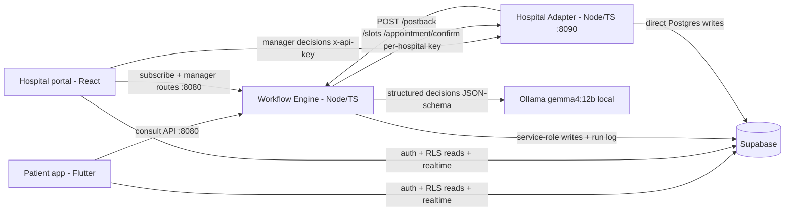

# AppointMed Hospital Adapter (:8090)

Simulates "the hospital's own system" as a real REST API. The workflow engine
and the manager portal call it with a **per-hospital API key** (`x-api-key`);
it pushes booking-lifecycle updates back to the engine via `POST /postback`.

## Run

    npm install
    npm start          # tsx src/index.ts, listens on :8090
    npm test           # vitest contract tests (hits the hosted Supabase DB)
    npm run typecheck

Config via `.env`: `PORT`, `DATABASE_URL`, `ENGINE_URL`, `POSTBACK_SECRET`. Copy
`.env.example` to `.env` and replace the `YOUR_...` placeholders in `DATABASE_URL`
with your own Supabase Session pooler string — the repository ships **no**
credentials, so the adapter refuses to start until you do. Use the same string as
`appointmed_engine/.env`, and keep `POSTBACK_SECRET` identical in both files.
README.md §6 Part C/D walks through it.

The per-hospital API keys are demo *data*, not repository secrets: `npm run db:seed`
writes them into your own database (`amk_demo_…`, see `supabase/seed.sql`), and the
portal issues real ones as `amk_live_<24 hex>` on subscribe.

## Contract

| Route | Auth | Purpose |
|---|---|---|
| `GET /health` | none | liveness |
| `GET /specialists` | `x-api-key` | hospital's active specialists |
| `GET /slots?specialty=&maxPrice=&from=&to=&limit=` | `x-api-key` | open future slots, ordered by time |
| `POST /appointment/confirm` `{slotId, patientName, note?}` | `x-api-key` | submit booking → `pending`, returns `externalAppointmentId` |
| `POST /appointment/cancel` `{externalAppointmentId}` | `x-api-key` | cancel + reopen future slot |
| `POST /appointment/decision` `{externalAppointmentId, decision, proposedStartsAt?}` | `x-api-key` | manager confirm / decline / reschedule |

Outbound: `POST {ENGINE_URL}/postback` with header `x-postback-secret` and body
`{ externalAppointmentId, hospitalId, action: confirmed|declined|rescheduled|cancelled, proposedStartsAt? }`
— bounded retry ×3 (5s per-attempt timeout), delivery recorded on `hospital_bookings.postback_delivered`.

Errors are `{ "error": "code" }`: `missing_api_key`, `invalid_api_key` (401),
`slot_not_found`, `booking_not_found` (404), `slot_taken`, `already_decided` (409),
`invalid_decision`, `proposed_time_required`, `invalid_query` (400),
`internal_error` (500 — any unhandled fault; body never leaks driver/stack text).

---

# Architecture

> Reproduced here are the sections that concern the adapter: the system
> context (§1), the hospital integration surface (§4), the adapter's place in the data & security
> model (§5) and the adapter-side edge cases (§6). Paths are relative to this directory unless
> prefixed with `../`.

## System overview

AppointMed turns a fragmented, manual healthcare errand — *describe symptoms, work out which
specialist you need, find a slot you can afford at a hospital you can reach, get the hospital to
agree* — into a single automated workflow. Five components carry it. A **Flutter patient app**
(`../appointmed_mobile/`) is the patient's surface: it talks to the workflow engine for the
consultation and to Supabase directly for auth, row-level-security-scoped reads and realtime
appointment updates. A **Node/TypeScript workflow engine** (`../appointmed_engine/`, port 8080) is the
orchestrator and the only component that reasons: it runs a persisted seven-node state machine, and
at every node that requires a judgement it calls a **local LLM served by Ollama** (port 11434,
`gemma4:12b` by default) for a JSON-Schema-constrained decision, then dispatches deterministically on
the result. A **simulated hospital adapter** (this directory, port 8090) stands in
for a real hospital information system, exposing a per-hospital API-key REST surface for slot search,
booking and manager decisions, and calling back into the engine when a hospital decides. A **React
hospital portal** (`../appointmed_website/`, port 5173) puts a human in the loop: managers review the
AI's clinical case report and priority, then confirm, decline or reschedule — over the exact same public
adapter API a real hospital integration would use. **Hosted Supabase** (Postgres + Auth + Storage +
Realtime) is the shared substrate; clients read it under least-privilege RLS and can write almost
nothing (two narrow column grants), while the two Node services hold the privileged credentials.

The adapter contains no workflow logic — every decision, every external call and every state
transition happens inside the engine and is written to its append-only step log. What the adapter
owns is the hospital side of the world: inventory, row-locked reservations, `hospital_bookings`, and
the postback that tells the engine a manager has decided.

## Hospital integration surface

The adapter is a standalone service that models "the hospital's own system". Everything except
`/health` requires an `x-api-key` header, resolved to a hospital by
`hospital_api_keys → hospitals`; the lookup also bumps `request_count` and `last_used_at`
best-effort. Every route is scoped to `req.hospital.id` **in SQL**, so another hospital's data is not
merely hidden but unreachable.

| Method & path | Auth | Purpose | Key responses |
|---|---|---|---|
| `GET /health` | none | Liveness | `200 {status, service}` |
| `GET /specialists` | `x-api-key` | This hospital's active specialists | `200 {hospital, specialists[]}` |
| `GET /slots?specialty&maxPrice&from&to&limit` | `x-api-key` | Open, future, active-specialist slots. Defaults: window `now → +7 days`, `limit` 20 (max 100); `specialty` matches case-insensitively | `200 {hospital, slots[]}` · `400 invalid_query` |
| `POST /appointment/confirm` `{slotId, patientName, note?}` | `x-api-key` | Reserve a slot under `select … for update` and open a hospital-side booking | `201 {externalAppointmentId, status:"pending", slot}` · `404 slot_not_found` (unknown, foreign, past or malformed id) · `409 slot_taken` |
| `POST /appointment/cancel` `{externalAppointmentId}` | `x-api-key` | Cancel, reopen the slot, post back `cancelled` | `200 {…, postbackDelivered}` · `404 booking_not_found` |
| `POST /appointment/decision` `{externalAppointmentId, decision: confirm\|decline\|reschedule, proposedStartsAt?}` | `x-api-key` | The manager's decision; declines reopen the slot | `200 {…, postbackDelivered}` · `400 invalid_decision` / `proposed_time_required` · `404 booking_not_found` · `409 already_decided` |

**Keys are issued at subscription.** `POST /portal/subscribe` on the engine is deliberately
unauthenticated — a prospective hospital has no account yet. In one flow it creates the hospital row,
then an auth user carrying `app_metadata {role:"hospital_manager", hospital_id}` (only the
service-role admin API can set that, so a self-signup can never mint a manager), then, inside a
single transaction, the subscription, an `amk_live_<24 hex>` API key and three starter specialists
each seeded with half-hour slots across the next seven days excluding Sundays (six days, six slots a
day). Plans are `starter` RM 500 / 5 specialists,
`growth` RM 1,200 / 20, `enterprise` RM 2,500 / unlimited. Every failure path compensates — a
duplicate email deletes the orphan hospital row and returns `409 email_in_use`; a failure during the
inventory transaction deletes both the auth user and the hospital row before rethrowing. Rotation
(`POST /portal/api-key/regenerate`) deactivates all existing keys and inserts the replacement in one
transaction, so a hospital is never left with zero active keys.

A hospital becomes matchable simply by holding an *active* key — that is the engine's candidate-list
condition.

**Postback lifecycle.** When a manager decides (or a booking is cancelled), the adapter POSTs
`{externalAppointmentId, hospitalId, action, proposedStartsAt?}` to the engine's `/postback` with an
`x-postback-secret` header — a shared secret, not a user token, which is why that route is registered
outside the engine's bearer-auth scope. Delivery gets up to 3 attempts with a 5-second per-attempt
timeout and 500 ms / 1 000 ms backoff between them, and the outcome is recorded on the booking row
(`postback_delivered`, `postback_attempts`) so an undelivered decision is visible rather than lost.
On the engine side the secret is checked (`401`), the payload validated (`400` — including rejecting
an empty `externalAppointmentId`, which would otherwise behave as a wildcard), and the appointment
UPDATE is scoped by external id **and** hospital id **and** a non-terminal status, so replays and
cross-hospital attempts are `404`s that mutate nothing. `confirmed`/`cancelled` complete the run;
`declined` sends it back to `match` with that hospital excluded; `rescheduled` stores the proposed
time and waits for the patient.

**The portal exercises the same public API.** `../appointmed_website/src/lib/adapter.js` is a thin
`x-api-key` fetch wrapper around exactly the routes above. `Requests.jsx` — the real manager decision
queue — calls `adapter.decision(...)` with the hospital's own key, and the Integration page's **API
Tester** tab calls `adapter.getSpecialists / getSlots / confirm` with that same key. There is no
privileged back channel: the portal is a client of the hospital API, just as an integrating hospital
would be.

## The adapter in the data & security model

Of the **twelve** tables in `public`, the adapter owns the hospital side of bookings —
`hospital_bookings` — and reads/writes `specialists`, `slots` and `hospital_api_keys` under its own
direct Postgres connection. The platform-side `appointments` row is engine-owned; the two are joined
by `external_appointment_id`.

**Privileged credentials are confined to the two Node services.** The engine holds the Supabase
service-role key (Storage + auth admin) and a direct Postgres pool; the adapter holds only a direct
Postgres connection string. The Flutter app and the React portal ship the **anon key only** and
therefore see nothing RLS does not grant them.

`hospital_bookings` has RLS enabled and **zero** policies, so no client key can read it at all — the
hospital-side ledger is reachable only through this service's authenticated API.

**Secrets posture — stated plainly.** No credential is committed to this repository. The four config
files — `../appointmed_engine/src/config.ts`, `src/config.ts`,
`../appointmed_website/src/lib/config.js` and `../appointmed_mobile/lib/core/app_config.dart` — carry
`YOUR_...` placeholders, and each component refuses to start (or logs loudly, in the web portal's
case) while a placeholder survives, naming the file to fix. This service is fully environment-driven,
so its privileged values swap without a code change.

## Edge cases & failure handling

Every row cites the test that proves it.

| Situation | Behaviour | Proven by |
|---|---|---|
| Booking fails at the hospital (slot just taken) | The hospital side returns `409 slot_taken` under a row lock; the engine drops the run back to `match` with a "send any message and I'll find fresh options" reply | `test/booking.test.ts` — *"double-booking the same slot returns 409 slot\_taken"*; `../appointmed_engine/test/booking.test.ts` — *"adapter failure on confirm keeps the run alive with a retry reply"* |
| Postback cannot be delivered | 3 attempts with backoff; the decision still commits locally and `postback_delivered:false` is recorded and surfaced to the manager | `test/postback.test.ts` — *"retries after network failure and succeeds"*, *"gives up after 3 attempts and returns false"*; `test/decision.test.ts` — *"postback failure is reported, decision still succeeds"* |
| Malformed or hostile input | Rejected before it can reach a SQL cast | `test/booking.test.ts` — *"malformed slotId returns 404 slot\_not\_found, not 500"*; `test/decision.test.ts` — *"malformed proposedStartsAt is rejected 400, never reaches the timestamptz cast"* |
| Cross-tenant access attempt | Always a `404`, never another party's row — every route is scoped to `req.hospital.id` in SQL | `test/auth.test.ts` — *"key B authenticates as hospital B, not hospital A"* |
| A decision arriving twice | `409 already_decided`; the first decision stands and the slot is not reopened a second time | `test/decision.test.ts` — *"a decided booking cannot be decided again: 409, slot state intact"* |
| A slot that is past, foreign or inactive | Invisible rather than merely rejected — the SQL scope excludes it, so it is a `404` | `test/booking.test.ts` — *"a slot in the past is not bookable: 404 slot\_not\_found"*, *"another hospital's slot is invisible: 404"*; `test/slots.test.ts` — *"an explicit past `from` cannot surface past slots"* |

Unhandled faults become a single clean `500 {error:"internal_error"}` that never leaks driver or
stack text (see the error list above). That guarantee is asserted on the engine side
(`../appointmed_engine/test/error-handler.test.ts`); this suite covers it only indirectly.

**One honest gap.** There is *no* retry around the database. Postgres is treated as
must-be-available: an outage surfaces through the error handler as a clean `500`. Retry/circuit-breaking
exists for postback delivery (3 attempts), not for the datastore.
