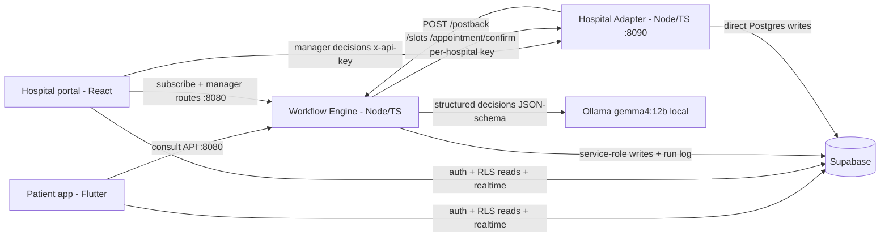
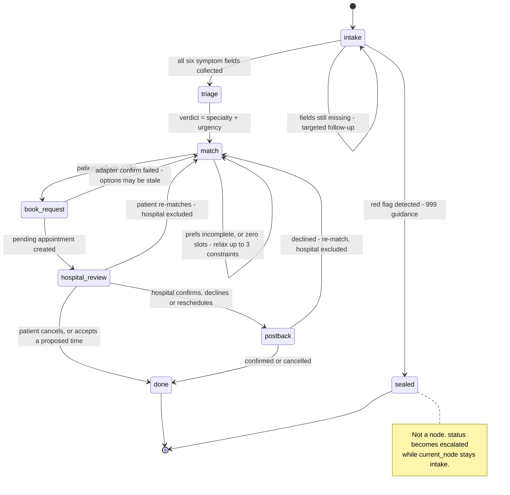

# appointmed_mobile

AppointMed's Flutter patient app: an AI symptom-triage chat that ends in a
confirmed hospital appointment. The chat talks to the local AppointMed
engine (not a hosted LLM API), which in turn talks to Ollama and a hospital
adapter for booking/decision flows.

## Prerequisites

Before the app can complete a consult end to end, have the rest of the
stack up:

- The Phase-1 Supabase seed applied (see `supabase/README.md` at the repo
  root).
- The local AppointMed engine running on `:8080`.
- The hospital adapter running on `:8090`.
- Ollama running (the engine's model backend).

## Run

```bash
flutter pub get
flutter run
```

Run on an Android emulator: the app reaches the engine at
`http://10.0.2.2:8080` (the emulator's alias for the host machine). On
other platforms it uses `http://localhost:8080` directly.

## Demo login

- Email: `patient@appointmed.demo`
- Password: `AppointMed!2026`

## Test & lint

```bash
flutter test        # all tests
flutter analyze      # static analysis / lint
```

---

# Architecture

> Reproduced here are the sections that concern this app: the system
> context (§1), the workflow the app drives and renders (§2), what the local LLM contributes to it
> (§3), the data & security model the app reads under (§5) and the patient-visible edge cases (§6).

## System overview

AppointMed turns a fragmented, manual healthcare errand — *describe symptoms, work out which
specialist you need, find a slot you can afford at a hospital you can reach, get the hospital to
agree* — into a single automated workflow. Five components carry it. A **Flutter patient app**
(this directory) is the patient's surface: it talks to the workflow engine for the
consultation and to Supabase directly for auth, row-level-security-scoped reads and realtime
appointment updates. A **Node/TypeScript workflow engine** (`../appointmed_engine/`, port 8080) is the
orchestrator and the only component that reasons: it runs a persisted seven-node state machine, and
at every node that requires a judgement it calls a **local LLM served by Ollama** (port 11434,
`gemma4:12b` by default) for a JSON-Schema-constrained decision, then dispatches deterministically on
the result. A **simulated hospital adapter** (`../appointmed_hospital_adapter/`, port 8090) stands in
for a real hospital information system, exposing a per-hospital API-key REST surface for slot search,
booking and manager decisions, and calling back into the engine when a hospital decides. A **React
hospital portal** (`../appointmed_website/`, port 5173) puts a human in the loop: managers review the
AI's clinical case report and priority, then confirm, decline or reschedule — over the exact same public
adapter API a real hospital integration would use. **Hosted Supabase** (Postgres + Auth + Storage +
Realtime) is the shared substrate; clients read it under least-privilege RLS and can write almost
nothing (two narrow column grants — see below), while the two Node services hold the privileged
credentials.



**This app contains no workflow logic.** It holds no prompts, no schemas and no state machine — it
renders `ConsultReply` envelopes (`lib/models/engine_models.dart`) and posts the patient's turns back.
Every decision, every external call and every state transition happens inside the engine and is
written to an append-only step log. The patient app and the hospital portal never call each other.

## The workflow this app drives

A consultation is a **run**: a row in `workflow_runs` holding a `current_node`, a `status` and a JSON
`state` blob. The engine keeps nothing in memory between requests — every turn loads the run from
Postgres, advances it, and saves it back. For this app that has a concrete consequence: a run survives
an engine restart, a lost connection or the app being killed, and `GET /consult/:runId` will resume it
with the full transcript.

`Node` has exactly seven values:
`intake | triage | match | book_request | hospital_review | postback | done`.
`RunStatus` has five: `active | waiting_hospital | completed | failed | escalated`. Both arrive on
every reply envelope, and the chat UI dispatches on them.

Two precise points that the diagram alone would hide:

- **Re-match is a transition, not a node.** A declined booking, or a patient choosing to re-match,
  sends `current_node` back to `match` with the offending hospital excluded from the next search.
- **`escalated` is a status, not a node.** When intake detects a red flag the run's status becomes
  `escalated` while `current_node` stays `intake`, and every later message is short-circuited to fixed
  emergency guidance without calling the model at all. The app should treat `escalated:true` as
  terminal for input purposes — uploads are refused with `409 consultation_escalated`.



What each node looks like from inside the app:

| Node | What the patient sees | What the app sends |
|---|---|---|
| `intake` | Follow-up questions until six symptom fields are known (main complaint, duration, severity, associated symptoms, history, medications). Vague or contradictory input gets a clarifying question, not a guess. A red flag ends the consult with 999 guidance | `sendMessage`; `uploadFile` (**intake only** — outside intake it is `409 uploads_only_during_intake`) |
| `triage` | Nothing separate — triage runs in the same turn intake completes, so one continuous reply carries the verdict, the disclaimer and the first booking question | — |
| `match` | Budget / hospital / time-of-day questions, then a slot list. If nothing matches, the assistant explains which constraint it is loosening and searches again (up to 3 times) | `sendMessage`, then `selectSlot` |
| `book_request` | A transient step, never a resting state — the reply comes back already at `hospital_review` | — |
| `hospital_review` | "Your booking request is with the hospital team." Any further message repeats that; `status` is `waiting_hospital` | nothing useful — wait for Realtime |
| `postback` | The hospital's decision arrives as a Realtime `appointments` update plus a `notifications` row, not as a chat turn | `respond` with `accept_reschedule` \| `re_match` \| `cancel` |
| `done` | Terminal; further messages get a "start a new consultation" reply | `startConsult` |

`slotOptions` are ephemeral: they are the options the engine actually presented, and `selectSlot`
rejects anything it did not present (`400 unknown_slot_option`). A second `selectSlot` on a booked run
is `409 already_booked` — the guard against a double tap — so the UI does not need to be the only thing
preventing it.

## What the local LLM contributes

`lib/services/engine_client.dart` is a plain HTTP client; all reasoning is server-side. The app is
nonetheless the surface where a model outage becomes visible, so it is worth knowing what degrades:

| Stage | With the local LLM | Without it |
|---|---|---|
| intake | Extracts six symptom fields from free text, asks targeted follow-ups, flags emergencies | Nothing is extracted; the run repeats an apologetic hold message forever and **never leaves `intake`** |
| attachment | Describes each uploaded photo or document in plain language at upload time, feeding both intake (documents) and triage (documents + photos) | The file still uploads and stores fine; its description just reads `NOT_ANALYSED` instead of a real one — a vision call never retries against the non-vision fallback model, so an unseen photo is never fabricated |
| triage | Chooses one of nine specialties and an urgency that sets the search window (2 days for `asap`, 7 otherwise) | Everyone is sent to General Practice, routine |
| triage (case report) | Writes the eleven-field clinical case report (chief complaint, history of present illness, triage assessment, priority, etc.) that the hospital manager reviews | `fallbackReport()`: a deterministic report assembled from the stored symptom fields and attachment descriptions; priority from the same static urgency map |
| match (prefs) | Reads budget, hospital and time-of-day out of conversational text | Preferences are never captured, so no slot search is ever issued |
| match (relax) | Picks which constraint to loosen given the situation, and explains it | Fixed `time → hospital → budget` order with a generic sentence |

Nothing crashes and no wrong booking is made — the chat keeps responding. But with Ollama stopped, a
two-message consultation captures **0 of 6** symptom fields and the run stays at `intake`/`active`.
If the app appears to loop on a hold message, check Ollama before suspecting the client.

Uploads are part of this: the default intake model `gemma4:12b` is multimodal, so a photo attached via
`uploadFile` is read by the model itself; PDFs are text-extracted server-side (first 4 000 chars) and
spliced into the same intake turn. Both land in the private `medical-files` bucket.

## Data & security model the app reads under

**Twelve tables**, all in `public`. The ones this app touches: `profiles`, `appointments`,
`notifications`, `ai_chats`, and the read-only catalog (`hospitals`, `specialists`, `slots`).

**RLS is least-privilege, and clients are read-only.** RLS is enabled on all twelve. Beyond policies,
the migration revokes write privilege outright —
`revoke insert, update, delete on all tables in schema public from anon, authenticated` — so a missing
policy fails closed with a clear error rather than silently permitting anything. There are exactly
**two write exceptions**, both column grants paired with an owner-scoped policy, and both are what
`lib/services/data_service.dart` uses:

- `grant update (full_name, passport, phone, avatar_url) on public.profiles` — a patient may edit
  their own profile but cannot touch `role` or `hospital_id` (`updateProfile`).
- `grant update (read_at) on public.notifications` — a user may mark their own notification read and
  nothing else (`markNotificationRead`).

**Every other write must go through the engine.** A client-side write failure is not a missing policy
to be added — it is a write that belongs in a service.

Read isolation, as it applies here:

- **Patient scope** — `profiles`, `ai_chats`, `notifications` are `= auth.uid()` only.
- **Shared** — `appointments` is visible when `user_id = auth.uid() OR hospital_id = current_hospital_id()`,
  which is exactly what lets this app and the hospital portal render the same booking from two sides.
- **Catalog** — `hospitals`, `specialists`, `slots` are readable by any signed-in user.
- **Workflow tables are service-only** — `workflow_runs`, `workflow_steps` and `hospital_bookings`
  have RLS enabled and **zero** policies, so the anon key cannot read them at all. The run log is
  reachable only through the engine's own owner-checked `GET /runs/:runId/steps`, which needs the
  patient's access token.

Storage is two private buckets: `medical-files` (patients may read their own, matched on the
`<user_id>/…` path prefix) and `verification-docs` (no client policy at all — service-role only). The
engine serves files via service-role signed URLs. Realtime publishes `appointments` and
`notifications` with `replica identity full`, and **RLS is enforced for those change streams** — which
is why `DataService`'s streams are safe to subscribe to directly.

Slot times are `Asia/Kuala_Lumpur` and the columns are `timestamptz` — don't reason about them in UTC.

**Secrets posture — stated plainly.** No credential is committed to this repository.
`lib/core/app_config.dart` carries `YOUR_...` placeholders, and the app refuses to start while one
survives — `main()` throws a `StateError` naming the file to fix (`lib/main.dart:29`). Real values come
from that file's literals or `--dart-define` at build time.
The **client-side anon key is a compile-time constant** (`static const` via `String.fromEnvironment`),
so rotating it means rebuilding and reshipping the app. That is a real limitation, not an oversight:
the layout is deliberately production-shaped (privileged keys server-side, anon key client-side, RLS
carrying the isolation), and a real deployment would inject all of these as managed secrets.

## Patient-visible edge cases

Each row is proven by an engine test (paths relative to the repo root).

| Situation | What the patient experiences | Proven by |
|---|---|---|
| Ambiguous or contradictory symptom description | A clarifying question rather than a guess; whatever *was* learned is kept | `../appointmed_engine/test/intake.test.ts` — *"incomplete intake asks a follow-up and merges fields"* |
| Missing booking preferences | The assistant keeps asking until budget, hospital and time are known; no premature slot list | `../appointmed_engine/test/match.test.ts` — *"incomplete prefs keep asking"* |
| Emergency red flag | 999 guidance, and the consult is **sealed**: later messages and uploads get fixed deterministic replies | `../appointmed_engine/test/intake.test.ts` — *"red flag escalates deterministically"*, *"an escalated run seals further messages to a fixed emergency reply (no LLM call)"*; `../appointmed_engine/test/upload.test.ts` — *"an escalated run seals the upload route: 409, nothing stored, no LLM call"* |
| No slots match | The assistant explains which constraint it is loosening, retries up to 3 times, then gives up *without* killing the run — the next message starts a fresh cycle | `../appointmed_engine/test/match.test.ts` — *"empty result triggers LLM-chosen relaxation (time) …"*, *"exhausted relaxations end with a friendly no-slots reply, run stays in match"* |
| Preferences are honoured, not discarded | Budget, hospital and time-of-day all visibly filter the options | `../appointmed_engine/test/match.test.ts` — *"prefs are used: budget + hospital + morning filter the options"* |
| Hospital declines | Back to matching automatically, with that hospital excluded from the next search | `../appointmed_engine/test/postback.test.ts` — *"declined postback re-enters match with the hospital excluded"* |
| Hospital proposes a different time | Accept it (appointment confirmed, run completes) or re-match (the proposal is cancelled at the hospital first) | `../appointmed_engine/test/respond.test.ts` — *"accept\_reschedule …"*, *"re\_match after a reschedule\_proposed appointment cancels it via the adapter first"* |
| Local LLM unreachable | An apologetic hold reply, never a crash and never a wrong booking; the run stays alive | `../appointmed_engine/test/intake.test.ts` — *"ollama outage during intake degrades gracefully, run stays alive"* |
| Hospital system unreachable during search | A retry-later reply; the next message re-searches | `../appointmed_engine/test/match.test.ts` — *"adapter outage during search is a logged error with a retry-later reply, not a dead end"* |
| The chosen slot was just taken | "Send any message and I'll find fresh options" — back to matching, nothing double-booked | `../appointmed_engine/test/booking.test.ts` — *"adapter failure on confirm keeps the run alive with a retry reply"* |
| Double-tapping the slot button | `409 already_booked`, with no second booking at the hospital | `../appointmed_engine/test/booking.test.ts` — *"a second select-slot on a booked run is rejected (no duplicate confirm or appointment)"* |
| Cancelling while the hospital is unreachable | The cancellation still succeeds locally — the hospital call is best-effort | `../appointmed_engine/test/respond.test.ts` — *"cancel is best-effort: an adapter outage does not block the patient cancel"* |
| Someone else's run or appointment id | Always `404`, never another patient's data | `../appointmed_engine/test/intake.test.ts` — *"foreign run id → 404"*; `../appointmed_engine/test/respond.test.ts` — *"responding to a foreign patient's appointment returns 404, never someone else's row"* |
| Unexpected server error | A single clean `{ "error": "internal_error" }` — never a stack trace to render | `../appointmed_engine/test/error-handler.test.ts` |

**One honest caveat.** The engine has no retry around the database, and a process dying *mid-turn*
loses that turn — nothing is persisted until it succeeds, so nothing is corrupted, but the patient
simply resends. Retries exist for the model (4 attempts) and for postback delivery (3 attempts), not
for the datastore.
