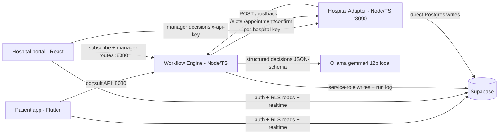

# AppointMed Hospital Portal (:5173)

AppointMed's manager-facing web portal: where a hospital **subscribes** to the platform, gets its API
key, and works the queue of AI-triaged booking requests — reviewing each case summary and priority,
then confirming, declining or proposing a new time.

It is the human-in-the-loop half of the workflow. The patient app produces a `pending` appointment;
this portal is where a real person decides on it. Crucially, it makes those decisions over the **same
public hospital API an integrating hospital would use** (`x-api-key` against the adapter on `:8090`) —
there is no privileged back channel, and no workflow logic lives here.

**Stack:** React 19, Vite 8, React Router 7, `@supabase/supabase-js`. No TypeScript, no test runner —
`lint` and `build` are the checks.

## Prerequisites

The portal is a client of three things, so have them up before expecting live data:

- Your Supabase project migrated and seeded — `npm run db:push && npm run db:seed` from the repo root
  (see `../supabase/README.md`).
- The workflow engine on `:8080` (`../appointmed_engine/`) — subscribe and manager routes.
- The hospital adapter on `:8090` (`../appointmed_hospital_adapter/`) — specialists, slots, decisions.

`npm run dev` from the **repo root** starts the adapter, the engine and this portal together. Ollama is
not needed by the portal itself; it is needed for a patient consult to generate a request to review.

## Run

```bash
npm install
npm run dev        # Vite dev server on http://localhost:5173
npm run build      # production build
npm run preview    # serve the production build
```

## Demo login

- Email: `manager@appointmed.demo`
- Password: `AppointMed!2026`

Seeded as the manager of **KL Medical Center**. Everything the account sees is scoped to that hospital
by RLS, not by the UI. To watch the subscribe flow instead, use `/register` and create a new hospital.

## Routes

| Route | Page | Guard | What it does |
|---|---|---|---|
| `/` | `Landing` | — | Manager sign-in, the patient-value section, and published pricing |
| `/register` | `Register` | — | The subscribe flow → `POST /portal/subscribe` on the engine; provisions the hospital, manager account, API key and starter inventory |
| `/dashboard` | `Dashboard` | `ProtectedRoute` | Hospital overview — pending requests, a by-specialty breakdown and recent activity, kept live by its own `postgres_changes` subscription on `appointments` |
| `/requests` | `Requests` | `ProtectedRoute` | **The real decision queue** — renders `ai_summary` + priority badge, subscribes to `postgres_changes` on `appointments`, calls `adapter.decision(...)` |
| `/settings` | `Settings` | `ProtectedRoute` | Five tabs: Manager Profile, Hospital Info, Subscription, Specialists (`/portal/specialists/:id/toggle`) and Documents (`/portal/verification-docs`) |
| `/integration/*` | `Integration` | `ProtectedRoute` | Three tabs: API Key (view / rotate), Documentation, and a live **API Tester** hitting `getSpecialists / getSlots / confirm` |

`ProtectedRoute` (`src/components/ProtectedRoute.jsx`) gates on the Supabase session held by
`src/context/AuthContext.jsx`.

## Layout

Three clients in `src/lib/`, and that is the whole outside world:

| File | Talks to | Used for |
|---|---|---|
| `supabase.js` | Supabase (anon key) | RLS-scoped reads + Realtime subscriptions |
| `engine.js` | engine `:8080` | `/portal/subscribe`, `/portal/verification-docs`, `/portal/specialists/:id/toggle`, `/portal/api-key/regenerate` |
| `adapter.js` | adapter `:8090` | `getSpecialists`, `getSlots`, `confirm`, `decision` — each takes the hospital's own API key as its first argument, read from `hospital_api_keys` under RLS |

UI primitives are a hand-rolled library in `src/components/ui/` (Button, Card, Modal, Tabs, Toast, …),
each a `.jsx` + `.css` pair re-exported through `src/components/ui/index.js` — prefer these over raw
HTML elements. Design tokens live in `src/styles/variables.css` and `global.css`.

## Config

`src/lib/config.js` is the single place values are resolved:

| Value | Default | Override |
|---|---|---|
| `SUPABASE_URL` | **placeholder — must be set** | `VITE_SUPABASE_URL` |
| `SUPABASE_ANON_KEY` | **placeholder — must be set** | `VITE_SUPABASE_ANON_KEY` |
| `ENGINE_URL` | `http://localhost:8080` | `VITE_ENGINE_URL` |
| `ADAPTER_URL` | `http://localhost:8090` | `VITE_ADAPTER_URL` |

Either edit the two `YOUR_...` literals in `src/lib/config.js`, or copy `.env.example` to `.env.local`
(git-ignored) and set the `VITE_*` vars — env values win over the literals. Until one of those is done,
`src/lib/supabase.js` `console.error`s at import time naming the file to fix, and every query would
otherwise fail against a host that does not exist.

**Only ever the anon/public key here.** This file is bundled into a page anyone can view; the
service-role key belongs to the two Node services alone.

## Lint & build

```bash
npm run lint       # ESLint 9, flat config in eslint.config.js
npm run build      # the other gate — a broken import fails here, not in lint
```

---

# Architecture

> Reproduced here are the sections that concern the portal: the system
> context (§1), the hospital integration surface it is a client of (§4), the data & security model it
> reads under (§5), what it contributes to the rubric (§8) and why it was rebuilt (§9).

## System overview

AppointMed turns a fragmented, manual healthcare errand — *describe symptoms, work out which
specialist you need, find a slot you can afford at a hospital you can reach, get the hospital to
agree* — into a single automated workflow. Five components carry it. A **Flutter patient app**
(`../appointmed_mobile/`) is the patient's surface: it talks to the workflow engine for the
consultation and to Supabase directly for auth, row-level-security-scoped reads and realtime
appointment updates. A **Node/TypeScript workflow engine** (`../appointmed_engine/`, port 8080) is the
orchestrator and the only component that reasons: it runs a persisted seven-node state machine, and
at every node that requires a judgement it calls a **local LLM served by Ollama** (port 11434,
`gemma4:12b` by default) for a JSON-Schema-constrained decision, then dispatches deterministically on
the result. A **simulated hospital adapter** (`../appointmed_hospital_adapter/`, port 8090) stands in
for a real hospital information system, exposing a per-hospital API-key REST surface for slot search,
booking and manager decisions, and calling back into the engine when a hospital decides. A **React
hospital portal** (this directory, port 5173) puts a human in the loop: managers review the
AI's case summary and priority, then confirm, decline or reschedule — over the exact same public
adapter API a real hospital integration would use. **Hosted Supabase** (Postgres + Auth + Storage +
Realtime) is the shared substrate; clients read it under least-privilege RLS and can write almost
nothing (two narrow column grants — see below), while the two Node services hold the privileged
credentials.



**The portal contains no workflow logic**, and it never calls the patient app. Its three clients in
`src/lib/` are all it talks to the world with: `supabase.js` (anon key, RLS reads + Realtime),
`engine.js` (`/portal/subscribe`, `/portal/verification-docs`, `/portal/specialists/:id/toggle`,
`/portal/api-key/regenerate`) and `adapter.js` (a thin `x-api-key` wrapper over the public hospital
API).

## The hospital integration surface the portal is a client of

The adapter is a standalone service that models "the hospital's own system". Everything except
`/health` requires an `x-api-key` header, resolved to a hospital by
`hospital_api_keys → hospitals`; the lookup also bumps `request_count` and `last_used_at`
best-effort. Every route is scoped to `req.hospital.id` **in SQL**, so another hospital's data is not
merely hidden but unreachable.

| Method & path | Auth | Purpose | Key responses |
|---|---|---|---|
| `GET /health` | none | Liveness | `200 {status, service}` |
| `GET /specialists` | `x-api-key` | This hospital's active specialists | `200 {hospital, specialists[]}` |
| `GET /slots?specialty&maxPrice&from&to&limit` | `x-api-key` | Open, future, active-specialist slots. Defaults: window `now → +7 days`, `limit` 20 (max 100); `specialty` matches case-insensitively | `200 {hospital, slots[]}` · `400 invalid_query` |
| `POST /appointment/confirm` `{slotId, patientName, note?}` | `x-api-key` | Reserve a slot under `select … for update` and open a hospital-side booking | `201 {externalAppointmentId, status:"pending", slot}` · `404 slot_not_found` (unknown, foreign, past or malformed id) · `409 slot_taken` |
| `POST /appointment/cancel` `{externalAppointmentId}` | `x-api-key` | Cancel, reopen the slot, post back `cancelled` | `200 {…, postbackDelivered}` · `404 booking_not_found` |
| `POST /appointment/decision` `{externalAppointmentId, decision: confirm\|decline\|reschedule, proposedStartsAt?}` | `x-api-key` | The manager's decision; declines reopen the slot | `200 {…, postbackDelivered}` · `400 invalid_decision` / `proposed_time_required` · `404 booking_not_found` · `409 already_decided` |

**The portal exercises the same public API.** `src/lib/adapter.js` is a thin `x-api-key` fetch wrapper
around exactly the routes above. `Requests.jsx` — the real manager decision queue — calls
`adapter.decision(...)` with the hospital's own key, and the Integration page's **API Tester** tab
calls `adapter.getSpecialists / getSlots / confirm` with that same key. There is no privileged back
channel: the portal is a client of the hospital API, just as an integrating hospital would be.

**Keys are issued at subscription.** `POST /portal/subscribe` on the engine — the endpoint behind
`/register` — is deliberately unauthenticated, because a prospective hospital has no account yet. In
one flow it creates the hospital row, then an auth user carrying
`app_metadata {role:"hospital_manager", hospital_id}` (only the service-role admin API can set that,
so a self-signup can never mint a manager), then, inside a single transaction, the subscription, an
`amk_live_<24 hex>` API key and three starter specialists each seeded with half-hour slots across the
next seven days excluding Sundays (six days, six slots a day). Plans are `starter` RM 500 /
5 specialists, `growth` RM 1,200 / 20, `enterprise` RM 2,500 / unlimited — the same figures the
Landing page publishes. Every failure path compensates — a duplicate email deletes the orphan hospital
row and returns `409 email_in_use`; a failure during the inventory transaction deletes both the auth
user and the hospital row before rethrowing. Rotation (`POST /portal/api-key/regenerate`, the
Integration page's API Key tab) deactivates all existing keys and inserts the replacement in one
transaction, so a hospital is never left with zero active keys.

A hospital becomes matchable simply by holding an *active* key — that is the engine's candidate-list
condition, and therefore what a manager is really toggling when they rotate or deactivate.

**Postback lifecycle.** When a manager decides in `Requests.jsx`, the adapter POSTs
`{externalAppointmentId, hospitalId, action, proposedStartsAt?}` to the engine's `/postback` with an
`x-postback-secret` header. Delivery gets up to 3 attempts with a 5-second per-attempt timeout and
500 ms / 1 000 ms backoff, and the outcome is recorded on the booking row (`postback_delivered`,
`postback_attempts`) and returned to the caller as `postbackDelivered` — so an undelivered decision is
visible to the manager rather than lost. `confirmed`/`cancelled` complete the patient's run;
`declined` sends it back to matching with that hospital excluded; `rescheduled` stores the proposed
time and waits for the patient.

## Data & security model the portal reads under

**Twelve tables**, all in `public`. The ones this portal reads: `profiles`, `hospitals`,
`subscriptions`, `hospital_api_keys`, `specialists`, `slots`, `appointments`, `notifications`.

**RLS is least-privilege, and clients are read-only.** RLS is enabled on all twelve. Beyond policies,
the migration revokes write privilege outright —
`revoke insert, update, delete on all tables in schema public from anon, authenticated` — so a missing
policy fails closed with a clear error rather than silently permitting anything. There are exactly
**two write exceptions**, both column grants paired with an owner-scoped policy:

- `grant update (full_name, passport, phone, avatar_url) on public.profiles` — a manager may edit
  their own profile but cannot touch `role` or `hospital_id`.
- `grant update (read_at) on public.notifications` — a user may mark their own notification read and
  nothing else.

**Every other write goes through the engine or the adapter**, which alone hold privileged credentials.
A failing write from the portal is not a missing policy to be added — it is a write that belongs in a
service call (`engine.js` or `adapter.js`).

Read isolation, as it applies here:

- **Manager scope** — `subscriptions` and `hospital_api_keys` are scoped by
  `public.current_hospital_id()`, a `security definer stable` SQL function that reads the caller's own
  profile; using a function keeps policies from recursively reading `profiles`.
- **Shared** — `appointments` is visible when `user_id = auth.uid() OR hospital_id = current_hospital_id()`,
  which is exactly what lets the patient app and this portal render the same booking from two sides.
- **Catalog** — `hospitals`, `specialists`, `slots` are readable by any signed-in user.
- **Workflow tables are service-only** — `workflow_runs`, `workflow_steps` and `hospital_bookings`
  have RLS enabled and **zero** policies, so the anon key cannot read them at all. The portal sees the
  AI's conclusions (`ai_summary`, `suggested_priority` on `appointments`), never the patient's raw
  transcript or run log.

Realtime publishes `appointments` and `notifications` with `replica identity full`, and **RLS is
enforced for those change streams** — which is why `Requests.jsx` can subscribe to `postgres_changes`
on `appointments` directly and only ever receive its own hospital's rows. Verification documents go to
a private `verification-docs` bucket with **no client policy at all** (service-role only), which is why
they upload through `POST /portal/verification-docs` rather than the Supabase client.

Slot times are `Asia/Kuala_Lumpur` and the columns are `timestamptz` — don't reason about them in UTC.

**Secrets posture — stated plainly.** No credential is committed to this repository.
`src/lib/config.js` carries `YOUR_...` placeholders, and while one survives `src/lib/supabase.js:7`
`console.error`s loudly at import time, naming the file to fix rather than letting every query fail
against a host that does not exist. Real values come from that config file's literals or
`VITE_SUPABASE_*` in `.env.local`
(`ENGINE_URL` / `ADAPTER_URL` read `VITE_ENGINE_URL` / `VITE_ADAPTER_URL`). The **client-side anon key
is a compile-time constant** — an exported literal — so rotating it means rebuilding and reshipping the
portal. That is a real limitation, not an oversight: the layout is deliberately production-shaped
(privileged keys server-side, anon key client-side, RLS carrying the isolation), and a real deployment
would inject all of these as managed secrets.

## What the portal contributes to the rubric

| Rubric requirement | Where the portal satisfies it | How to demo |
|---|---|---|
| Structured, actionable outputs | Not just prose: the engine writes a `pending` `appointments` row with `created_via_ai`, `ai_summary` and `suggested_priority` atomically with its notification. `Requests.jsx` renders `ai_summary` and a priority badge, which is what the manager actually triages on | Open the Requests queue after a patient books: the pending request shows the AI case summary and a HIGH/MEDIUM/LOW priority badge, with Confirm / Decline / Reschedule actions |
| Dynamic task orchestration incl. tool/API interactions | The manager's decision is a real cross-service call — `adapter.decision(...)` with the hospital's own key — which reopens or holds the slot and posts back into the engine, resuming the patient's run | Confirm a request and watch the patient's appointment flip to `confirmed` with `status_source:"hospital_postback"`; the Integration page's API Tester tab hits `getSpecialists / getSlots / confirm` live |

## Why the portal was rebuilt (v1 → v2)

The first submission was judged to have a strong pitch and a thin implementation — *"the web portal is
fully mocked and it ultimately functions as basic symptom chatbot rather than an automated workflow
system."* The rows most relevant to this directory:

| Area | v1 | v2 | Why it matters |
|---|---|---|---|
| Hospital portal | Fully mocked UI; all data hardcoded in local React state, no network calls at all | Real portal: authenticated, reads live data under RLS, subscribes to Realtime, and makes genuine manager decisions over the hospital API | This was the judges' stated reason for the loss |
| Booking model | The assistant auto-confirmed the appointment straight into the datastore | Hospital-in-the-loop: request → manager confirm/decline/reschedule → postback → patient notified | Makes the workflow a *multi-party* process rather than a single write |
| Hospital integration | The portal *simulated* an integration console; no service existed behind it | A running adapter service with per-hospital API keys, row-locked booking, and postback delivery with retries — exercised by the portal's own API tester | "Planned API integration" became a running one |
| Subscription | No answer to "how would a hospital subscribe?" | `POST /portal/subscribe`: plan selection, manager account, API key and starter inventory provisioned transactionally with compensation on every failure path | Closes the reviewer's explicit business-model question |
| Data platform | The previous cloud BaaS, with a wide-open rule set (`allow read, write: if true`) | Postgres with least-privilege RLS: clients read-only apart from two column grants, workflow tables service-only | Demo-shaped security replaced with production-shaped security |
